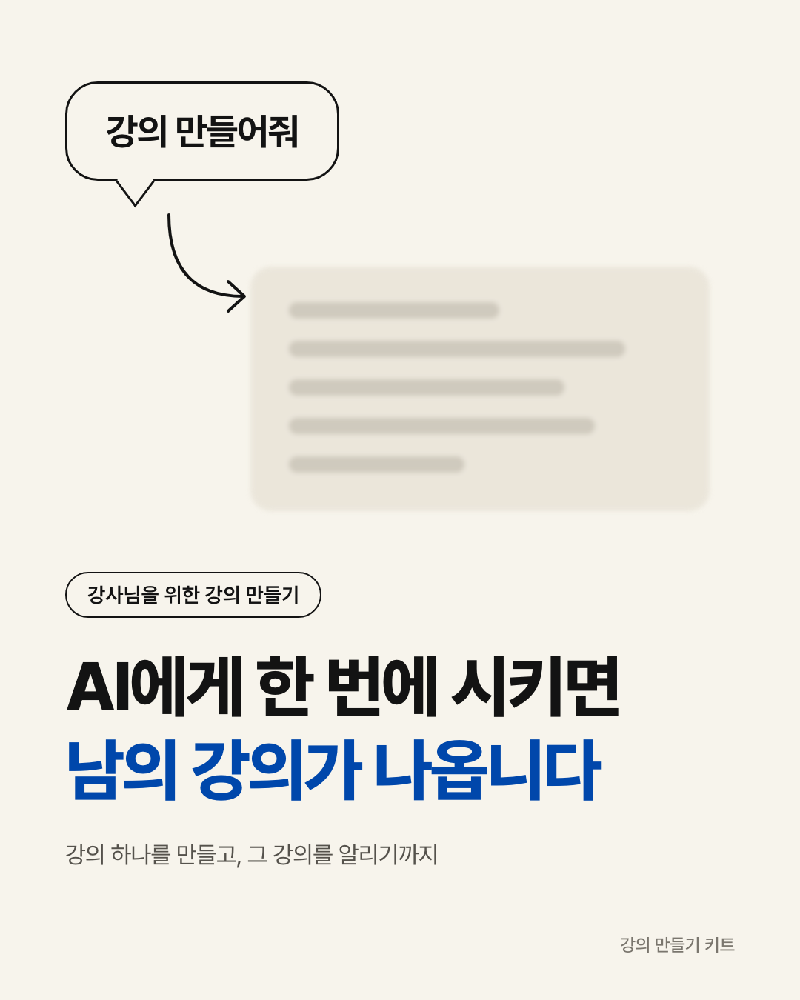

# 강의 콘텐츠 키트

[](LICENSE)

강의 하나를 AI와 함께 만들고, 그 강의를 알리는 글·카드뉴스·숏폼 기획까지 이어서 만드는 키트입니다. 개발을 몰라도 쓸 수 있게 만들었습니다.



## 무엇을 주나요

**1. 강의 만들기 6단계** — `01-강의만들기/`

AI에게 한 번에 "강의 만들어줘"라고 하지 않고, 여섯 단계로 나눠 단계마다 내가 고칩니다.

1. 자료조사를 대화로
2. 내 데이터 넣기 (지난 강의자료·녹음 받아쓴 글·자주 받는 질문)
3. 구조 설계서 (템플릿·예시 포함)
4. 장표 (방향키로 넘기는 발표용 HTML, 예시 장표 포함)
5. 프롬프터 (말할 것·손으로 할 것·막혔을 때)
6. 배포자료 (수강생용 안내 페이지)

**2. 소스 하나로 알리기** — `02-알리기/`

강의 원고 하나를 늘리고 줄여서 채널마다 씁니다.

- 블로그 긴 글 · 스레드 짧은 글 · AI 티 걷어내기
- 카드뉴스 (레퍼런스 분석 프롬프트 + 1080x1350 HTML 템플릿 8장 + 이미지로 뽑는 스크립트)
- 숏폼 기획 (대본·첫 3초 문장·강조 단어)
- 녹음 → 글

## 받는 법 (깃헙 계정 없어도 됩니다)

1. 이 페이지 위쪽 초록색 **Code** 버튼을 누릅니다.
2. **Download ZIP**을 누릅니다.
3. 받은 ZIP 파일의 압축을 풉니다. 맥은 파일을 더블클릭, 윈도우는 마우스 오른쪽 버튼 → **압축 풀기**. 터미널의 `unzip` 명령은 한글 파일 이름에서 실패하니 쓰지 마세요. 풀면 `lecture-content-kit-main` 폴더가 생깁니다. 바탕화면이나 문서 폴더 등 찾기 쉬운 곳에 두세요.

## 쓰는 법 두 가지

### 방법 1 · 프롬프트만 복사해서 채팅에 쓰기 (설치 없음)

1. 폴더에서 하고 싶은 단계의 `안내.md`를 엽니다. 깃헙 웹페이지에서 바로 열어 봐도 됩니다.
2. "복사할 프롬프트" 상자 안 내용을 복사합니다.
3. ChatGPT나 Claude 채팅창에 붙여 넣고 `[ ]` 안을 내 내용으로 바꿉니다.
4. 결과가 마음에 안 들면 안내문의 "마음에 안 들면 이렇게 말하세요" 문장을 참고해 고쳐 달라고 합니다.

강의 만들기 1~6단계는 **같은 대화창**에서 이어 가세요. 앞 단계 내용을 AI가 기억한 채로 진행됩니다.

### 방법 2 · Claude Code나 Codex에 폴더째 맡기기

**시작 전 확인**

- Claude Code 또는 Codex에 로그인돼 있고, 아무 말이나 보냈을 때 답이 오는지 먼저 확인하세요.
- 최신 버전으로 업데이트해 두세요. 오래된 버전은 첫 마디부터 `requires a newer version` 오류가 납니다.

**하는 법**

1. 압축 푼 폴더를 작업 폴더로 열어 둡니다.
   - **Claude Code** 터미널에 `cd`와 빈칸 하나를 입력하고, 압축 푼 폴더를 터미널 창에 끌어다 놓은 뒤 엔터. 이어서 `claude`를 입력합니다.
   - **Codex 앱** 새 작업을 시작할 때 작업 폴더로 압축 푼 폴더를 고릅니다.
2. 이렇게 말합니다.

```text
이 폴더 안내문 읽고 설치해줘
```

3. AI가 `AGENTS.md`(Claude Code는 `CLAUDE.md`)를 읽고 무엇을 만들지 물어봅니다. 고르면 해당 단계 안내대로 한 단계씩 확인받으며 진행합니다.
4. 내 결과물은 `내작업/` 폴더에 저장됩니다. 이 폴더는 깃에 올라가지 않습니다.

**막히면**

- `사용량 한도(usage limit)` 메시지가 뜨면 요금제 한도입니다. 풀릴 때까지 방법 1로 진행하세요.
- 맥에서 `API usage limits` 오류가 나면 환경변수 `ANTHROPIC_API_KEY`가 로그인보다 먼저 쓰이고 있는 것입니다. 그 변수를 지우고 다시 여세요.
- 윈도우 PowerShell에서 `claude` 또는 `codex`가 "이 시스템에서 스크립트를 실행할 수 없으므로"로 막히면 실행 정책 때문입니다. PowerShell을 열고 `Set-ExecutionPolicy -Scope CurrentUser RemoteSigned`를 한 번 실행한 뒤 다시 시도하세요.
- AI가 장표보다 구조 설계서를 먼저 만들자고 되물으면 정상입니다. 강의 제목, 시간, 끝나면 할 수 있는 것 한 줄을 알려주면 이어집니다.

## 준비물

| 쓰는 법 | 필요한 것 |
|---|---|
| 방법 1 | ChatGPT 또는 Claude 계정 (파일 첨부가 되는 요금제면 편합니다) |
| 방법 2 | Claude Code 또는 Codex |
| 카드뉴스를 이미지로 뽑기 | Chrome · Chromium · Edge 중 하나. 윈도우는 Git Bash에서 `bash render.sh`로 실행합니다 (둘 중 하나가 없으면 HTML을 브라우저로 열어 화면 캡처로 대신) |
| 장표·카드뉴스 보기 | 인터넷 연결 (글꼴을 CDN에서 불러옵니다) |

API 키는 필요 없습니다.

## 폴더 안내

| 폴더·파일 | 하는 일 |
|---|---|
| `01-강의만들기/` | 강의 만들기 6단계 안내, 설계서·프롬프터 템플릿, 예시 장표 |
| `01-강의만들기/4-장표/lecture-deck/` | 장표 만드는 규칙과 스타일 (Codex 등 다른 도구용 사본) |
| `02-알리기/` | 블로그·스레드, 카드뉴스, 숏폼 기획, 녹음 → 글 |
| `02-알리기/2-카드뉴스/template/` | 카드뉴스 HTML 템플릿과 이미지 변환 스크립트 |
| `.claude/skills/lecture-deck/` | Claude Code가 자동으로 인식하는 장표 스킬 |
| `AGENTS.md` · `CLAUDE.md` | AI가 이 폴더를 받았을 때 따르는 작업 안내 |
| `docs/` | README용 예시 이미지 |

기본 색은 아이보리 `#F7F4EC` · 검정 `#131313` · 코발트 `#0047AB`입니다. 장표와 카드뉴스 모두 CSS 세 줄만 바꾸면 내 색이 됩니다.

## 사용한 오픈소스

이 키트는 아래 공개 저장소의 규칙과 방법을 참고하거나 안내합니다. 고마운 분들입니다.

| 저장소 | 만든 곳 | 이 키트에서 쓰는 곳 |
|---|---|---|
| [ReelForge](https://github.com/gongnyang/reelforge) | [gongnyang](https://github.com/gongnyang) | 장표·카드뉴스 디자인 규칙 (Apache-2.0, 규칙을 옮겨 적음 — `NOTICE.md`) |
| [bookforge](https://github.com/gongnyang/bookforge) | gongnyang | 녹음 → 글 → 전자책 (안내) |
| [gongnyang-prompt-kit](https://github.com/gongnyang/gongnyang-prompt-kit) | gongnyang | 카드뉴스 이미지 프롬프트 (안내) |
| [codex-fleet](https://github.com/gongnyang/codex-fleet) | gongnyang | 이미지 대량 생성 (안내) |
| [im-not-ai](https://github.com/epoko77-ai/im-not-ai) | epoko77-ai | 글 마지막 손질 기준 (참고) |
| [k-skill](https://github.com/NomaDamas/k-skill) | NomaDamas | 글 손질 (안내) |
| [HyperFrames](https://github.com/heygen-com/hyperframes) | HeyGen | 숏폼 화면을 영상으로 렌더 (안내) |
| [Qwen3-TTS](https://github.com/QwenLM/Qwen3-TTS) | QwenLM | 숏폼 나레이션 음성 (안내) |
| [whisper.cpp](https://github.com/ggml-org/whisper.cpp) | ggml-org | 녹음 받아쓰기 (안내) |

"안내"로 표시한 저장소는 코드를 이 키트에 넣지 않았습니다. 쓸 때는 각 저장소의 라이선스와 안내를 따르세요.

## 저작권·면책

- 이 키트의 문서·템플릿·스크립트는 [MIT 라이선스](LICENSE)로 배포합니다. 저작권자: AIxSCHOOL
- 제3자 저장소와의 관계는 [NOTICE.md](NOTICE.md)에 적었습니다.
- 글꼴(Pretendard) 파일은 포함하지 않고 CDN으로 불러옵니다.
- 예시 파일(`예시-*.md`, 예시 장표, 카드뉴스 템플릿 문장)은 형식을 보여주기 위한 것입니다. 내 강의에는 내 자료로 새로 쓰세요.
- AI가 만든 결과물의 사실 여부, 저작권, 게시 책임은 사용하는 분에게 있습니다. 게시 전에 직접 확인하세요.
- 다른 사람의 카드뉴스·글·목소리를 그대로 복제하지 마세요. 레퍼런스는 분석해서 규칙으로만 씁니다.
- 이 키트는 결과를 보장하지 않으며, 사용으로 생긴 손해에 책임지지 않습니다.

## 문의·기여

- 민감정보 발견이나 권리 침해 신고: [SECURITY.md](SECURITY.md)
- 고칠 점 제안, 더 나은 프롬프트: [CONTRIBUTING.md](CONTRIBUTING.md)
